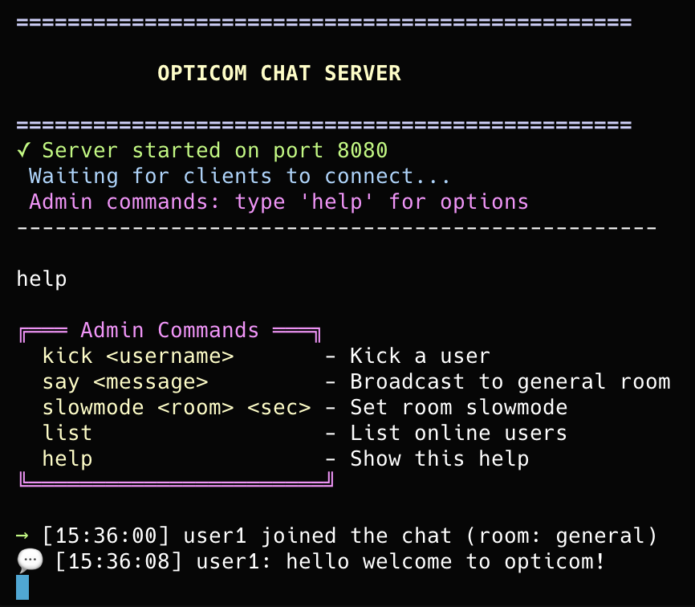
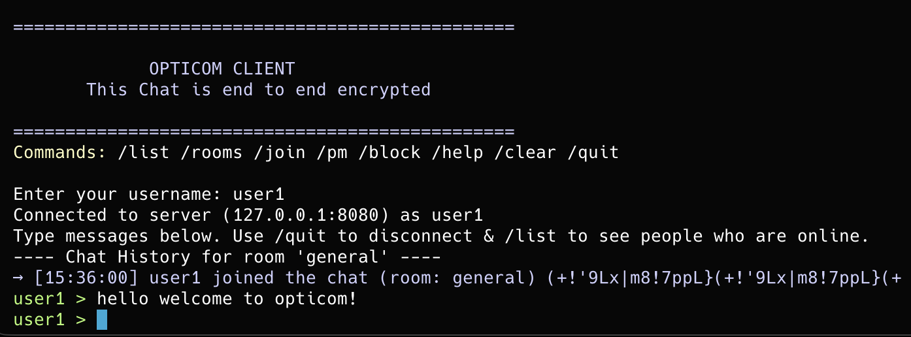
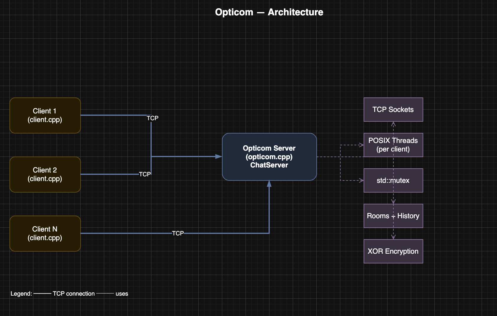

# Opticom — High-Performance Multi-Client Chat Server

**A production-style TCP chat server and client in C++**, built from the ground up with concurrency, encryption, and real-time multi-room chat. No frameworks—just sockets, threads, and systems programming.

---

## Why this project?

Opticom showcases **systems programming**, **concurrent server design**, and **low-level networking** in C++. It’s the kind of project that demonstrates you can:

- Design and implement a **multi-threaded TCP server** with thread-safe client management
- Handle **multiple clients** using POSIX threads and mutex-based synchronization
- Implement **real-time features** (rooms, private messages, broadcast) with clear protocols
- Add **security-oriented features** (message encryption, user blocking, rate limiting)
- Build a **usable CLI client** with a clean, colorized terminal UI

Ideal for roles in **backend systems**, **distributed systems**, **networking**, or **C++/systems development**.

---

## Tech stack

| Area | Technologies |
|------|--------------|
| **Language** | C++17 |
| **Networking** | TCP sockets (POSIX), client–server architecture |
| **Concurrency** | POSIX threads (pthreads), `std::mutex`, lock guards |
| **Platform** | Linux, macOS (Unix/POSIX) |
| **Build** | Make, g++/clang++ |

---

## Highlights

- **Multi-client server** — Thread-per-client model; handles many simultaneous connections
- **Thread-safe design** — Mutex-protected shared state; safe add/remove of clients
- **Chat features** — Rooms, private messages, pinned messages, persistent history per room
- **Security** — XOR-based message encryption in transit, user blocking, rate limiting (e.g. 3 msg/s), room slowmode
- **Admin tooling** — In-process admin console: kick users, broadcast, set room slowmode
- **Robustness** — Signal handling (SIGINT/SIGTERM), graceful shutdown, configurable port
- **Cross-platform** — Builds and runs on Linux and macOS; run on Windows via WSL or a Linux VM

---

## Quick start

```bash
# Build server and client
make

# Terminal 1: start server (default port 8080)
./opticom

# Terminal 2 & 3: connect clients
./client
# Or: ./client <host> <port>
```

**Try it:** Start the server, open 2+ clients, type in one—messages appear in the others. Use `/join <room>`, `/pm <user> <msg>`, `/block <user>`, and see the [Client commands](#client-commands) below.

---

## In Action

**Server console** — Admin view with colored logs, user list, and room activity:



**Client** — Colorized chat UI with rooms, private messages, and commands:



---

## Features

### Core

- **Multi-client support** — Many clients at once via threading
- **Real-time messaging** — Broadcast and room-based delivery
- **Thread-safe** — Mutex-protected client list and shared data
- **Cross-platform** — Linux, macOS (and Windows via WSL/VM)
- **Signal handling** — Clean shutdown on Ctrl+C
- **Configurable port** — Run on any available port

### Security

- **Message encryption** — XOR-based encryption between client and server
- **User blocking** — Block/unblock users; blocked users can’t PM you
- **Rate limiting** — Spam protection (e.g. 3 messages per second)
- **Room slowmode** — Admin-controlled cooldown per room

### Chat

- **Rooms** — Create and join rooms; messages scoped to room
- **Private messages** — Direct messages to a user
- **Message history** — Persistent per-room history saved to files
- **Pinned messages** — Pin messages to room boards; view with `/pins`
- **User list** — See online users and their rooms

### Server administration

- **Admin console** — Commands in the server process
- **User management** — Kick users, broadcast server messages
- **Room management** — Set slowmode per room
- **Logging** — Color-coded server logs for monitoring

---
## Project structure
## Architecture (high level)

- **TCP sockets** for reliable communication
- **POSIX threads** for one thread per connected client
- **Mutex locks** for thread-safe client list and shared state
- **Signal handling** for graceful shutdown and cleanup



---

## Building & running

### Prerequisites

- C++17 compiler (g++, clang++)
- POSIX environment (Linux, macOS)
- Make

### Build

```bash
make              # Server + client
make opticom      # Server only
make client       # Client only
make debug        # Debug build
make clean        # Clean artifacts
```

### Run

```bash
./opticom           # Server on port 8080
./opticom 9090      # Server on port 9090
./client            # Client → localhost:8080
./client 192.168.1.100 8080   # Client → specific host:port
```

---

## Client commands

| Command | Description |
|--------|-------------|
| `/help` | Show all commands |
| `/list` | Online users and their rooms |
| `/rooms` | Active rooms and user counts |
| `/join <room>` | Join or create a room |
| `/pm <user> <msg>` | Private message |
| `/pin <message>` | Pin message in current room |
| `/pins` | Show pinned messages |
| `/block <user>` | Block a user |
| `/unblock <user>` | Unblock |
| `/blocklist` | List blocked users |
| `/quit` | Disconnect |

---

## Server admin commands

In the server console:

| Command | Description |
|--------|-------------|
| `list` | Connected users, IPs, rooms |
| `kick <username>` | Kick user |
| `say <message>` | Broadcast to general room |
| `slowmode <room> <seconds>` | Set room slowmode |
| `help` | Show admin commands |

---


## Technical notes

- **Server:** `ChatServer` class, TCP bind/accept, thread-per-client, mutex-protected client list, room and history handling, XOR encryption, blocking and rate limiting.
- **Client:** TCP connect, send/receive loop, separate receive thread, encrypt/decrypt, colorized terminal UI.
- **Thread safety:** `std::mutex` and `lock_guard` for client list and shared state.
- **Encryption:** XOR with shared key (educational; for production consider TLS).

---

## License

MIT — see [LICENSE](LICENSE).

---

